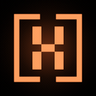

# AI Reactive Wallpaper (Hermes Neon H)

**Public repo:** [ASV-Labs/AI_Reactive_Wallpaper](https://github.com/ASV-Labs/AI_Reactive_Wallpaper)  
**Runtime plugin id:** `hermes-neon-h` (folder name must match)  
**Org:** [ASV Labs](https://github.com/ASV-Labs) (Charles Bonetti / A Salty Vet)  
**Type:** Hermes Desktop **disk plugin** (not OS wallpaper, not a Hermes core fork)

Animated neon **H** mark that reacts to AI **provider** health (OpenAI, Anthropic/Claude, Google, xAI) plus local Hermes turn-busy. Opt-in (`defaultEnabled: false`).



**v1.1.4 default:** a small **floating** in-window mark styled toward a **floating logo** (transparent chrome via CSS; drag on the mark itself) — not a docked workspace pane. Still an in-window Hermes float (not an OS pop-out).

Listed on the ASV Labs public index: [asv-labs.github.io](https://asv-labs.github.io).

Inspiration: Erik Johansson’s Omarchy reactive wallpaper — shipped here as a Hermes Desktop plugin pane, not an OS wallpaper daemon.

## Enable

1. Install the plugin folder (below).
2. Hermes Desktop → **Capabilities → Plugins** → enable **hermes-neon-h** (opt-in).
3. Optional: ⌘K → **Open Neon H** / **Open Neon H settings**, or use the status-bar chips.

## Install

```bash
export HERMES_HOME="${HERMES_HOME:-$HOME/.hermes}"
mkdir -p "$HERMES_HOME/desktop-plugins/hermes-neon-h"
curl -fsSL https://raw.githubusercontent.com/ASV-Labs/AI_Reactive_Wallpaper/main/plugin.js \
  -o "$HERMES_HOME/desktop-plugins/hermes-neon-h/plugin.js"
curl -fsSL https://raw.githubusercontent.com/ASV-Labs/AI_Reactive_Wallpaper/main/assets/logo.png \
  -o "$HERMES_HOME/desktop-plugins/hermes-neon-h/logo.png"
```

Or clone and copy:

```bash
git clone https://github.com/ASV-Labs/AI_Reactive_Wallpaper.git
mkdir -p "${HERMES_HOME:-$HOME/.hermes}/desktop-plugins/hermes-neon-h"
cp AI_Reactive_Wallpaper/plugin.js AI_Reactive_Wallpaper/assets/logo.png \
  "${HERMES_HOME:-$HOME/.hermes}/desktop-plugins/hermes-neon-h/"
```

Folder name **must** equal plugin id: `hermes-neon-h`.

Then in Hermes Desktop: **⌘K → Reload desktop plugins**.

Only `plugin.js` is required at runtime (mark is drawn procedurally). `assets/logo.png` is for install/readme branding only — not drawn on the canvas.

## Reload path (CoS / local)

```bash
export HERMES_HOME="${HERMES_HOME:-$HOME/.hermes}"
# default plugins dir
cp plugin.js "$HERMES_HOME/desktop-plugins/hermes-neon-h/plugin.js"
# profile desktop-plugins (e.g. vision) when present
cp plugin.js "$HERMES_HOME/profiles/vision/desktop-plugins/hermes-neon-h/plugin.js"
```

Then Hermes Desktop: **⌘K → Reload desktop plugins**. Settings → **Animation = Breathe**. Confirm the settings footer chip reads **`plugin 1.1.4`** (proves the new file is bound).

**x11grab note:** pure canvas 2D rAF may not damage the X pixmap under `--disable-gpu`. v1.1.3 added a DOM `transform`/`opacity` pulse on the mark wrap so the compositor (and grab) sees motion. **v1.1.4** sets the floating outer wrap to `overflow-visible` (1.1.3 `overflow-hidden` clipped the scale-up, so breathe looked static to humans/x11grab even while rAF ran) and hardens the pulse so it shrinks inward. Use [`demo/neon-h-breathe.gif`](./demo/neon-h-breathe.gif) for an offline X post asset.

## Floating default (v1.1.4)

| Behavior | Detail |
|---|---|
| Default placement | `floating`, anchor `bottom-right`, ~160×160px at scale 1.0 |
| Drag | On the mark itself — Hermes header is CSS-invisibly stretched over the float (SDK still only binds drag to `<header>`) |
| Title | Mark registers `title: ''` so the header text is blank (not the pane id) |
| Collapse / position | Persisted by Hermes for the pane id; collapse button hidden on mark float via CSS |
| Scale | `Alt` + mouse wheel over the mark (0.5–2.0); also in settings; stored in `ctx.storage` key `scale` |
| Mark chrome | Logo-like: transparent background, no border/shadow/radius (CSS on `[data-floating-pane="hermes-neon-h:mark"]` only) |
| Settings | Second floating pane keeps normal HUD chrome + title `Neon H settings` |

Placement or floating pixel size from scale takes effect after **⌘K → Reload desktop plugins**. Live Alt+wheel updates the stored scale immediately and previews with a transform.

| Choice | Registered surface |
|---|---|
| `floating` (default) | Native Hermes floating pane; draggable / collapsible |
| `bottom` / `top` | Workspace dock edge, 200px high |
| `left` / `right` | Workspace dock edge, 260px wide |

Invalid persisted placement values normalize to `floating`. Command-palette workspace previews are temporary tiles; the plugin closes them on reload, disable, or removal.

## Regression test

Portable Node test (no Hermes Desktop, credentials, or network):

```bash
npm test
```

Covers floating default, scaled floating geometry, dock placements, invalid-value normalization, and workspace-preview disposal.

## What you get

| Surface | Behavior |
|--------|----------|
| Pane **Neon H** (blank float title) | Floating logo-like mark by default; procedural neon H tinted by active provider + health |
| Pane **Neon H settings** | Colors (hex), animation mode, watched providers, **scale**, placement |
| Status bar (right) | Chips for OpenAI / Anthropic / Google / xAI |
| Palette | Open Neon H · Open Neon H settings |
| Optional | `host.openWorkspace` when available; otherwise pane fallback |

### Animation modes

`breathe` · `static` · `pulse-on-busy` · `outage-flash`

**Breathe** is a canvas `requestAnimationFrame` redraw in `drawNeonH` (neon look preserved) **plus** a DOM compositor pulse on the wrap (`transform: scale(0.55+0.55*breath)` ≈ 0.55–1.10, opacity, and `brightness`) so motion is visible to x11grab even when `--disable-gpu` leaves the X pixmap static. Canvas-only rAF can update pixels without damaging the grabbed surface. **v1.1.4 overflow-clip fix:** the floating MarkPane outer wrap is `overflow-visible` so the scale pulse is not clipped.

Offline demo (no Hermes): [`demo/neon-h-breathe.gif`](./demo/neon-h-breathe.gif) (~3s loop, 160×160). Regenerate with `npm run demo:gif` (needs `canvas` + `ffmpeg`).

### Visual mapping

- **operational** — calm breathe in provider color  
- **degraded** — amber / warn pulse  
- **major** — red flash  
- **`host.state.busy`** — intensifies pulse mid-turn  

Default provider colors: OpenAI `#10a37f`, Anthropic `#d4a27f`, Google `#4285f4`, xAI `#ff6b2c`.

### Status sources (CORS-friendly where possible)

| Provider | Endpoint | Notes |
|----------|----------|--------|
| OpenAI | `https://status.openai.com/api/v2/summary.json` | Statuspage indicator |
| Anthropic | `https://status.claude.com/api/v2/summary.json` | Claude status (Anthropic redirects here) |
| Google | `https://status.cloud.google.com/incidents.json` | **GCP status proxy** — not a dedicated Gemini consumer page |
| xAI | `https://status.x.ai/api/v2/summary.json` then HTML sniff | May stay **unknown** if both fail — we do not invent “operational” |

Poll interval ~50s (polite). Active provider is inferred from `host.state.model` / `host.state.profile` hints.

Settings persist via `ctx.storage` (plugin-scoped). Floating pane **position** is persisted by Hermes.

## SDK surface

Legal disk-plugin pane registration:

```js
ctx.register({
  id: 'mark',
  area: PANES_AREA,
  title: '', // blank header text; drag still via Hermes <header>
  data: { placement: 'floating', anchor: 'bottom-right', width: '160px', height: '160px' },
  render: MarkPane
})
```

Imports: `@hermes/plugin-sdk`, `react`, `react/jsx-runtime` only. Shared `$settings` atom for live settings.

## Honesty / limits

**Works**

- Floating in-window mark by default, CSS-minimized toward a logo look
- Drag on the mark (invisible Hermes header overlay); Alt+wheel scale + settings scale
- Procedural neon H (no PNG blob on canvas)
- DOM compositor pulse (transform/opacity) for capture-visible breathe
- Provider tint + busy pulse; status chips; settings

**Hermes floating-pane hard limit (verified on tip `floating-panes.tsx`)**

Hermes **always** renders floating panes as outer `HUD_SURFACE` (rounded border + background + shadow) plus a `<header>` that is the **only** drag handle (title + collapse). `PaneChrome` exposes placement/anchor/width/height for floats — there is **no** plugin data flag for frameless / `headerHidden` / transparent chrome. This plugin’s legal best-effort is: empty `title`, plus a one-time namespaced `<style>` targeting `[data-floating-pane="hermes-neon-h:mark"]` only (settings float stays normal). True frameless floats need a Hermes core change.

**Not available to disk plugins**

- True frameless / headerless floating panes (core must add the flag)
- OS-wide always-on-top / Shift-click pet overlay pop-out (Hermes core Pets only)
- Surviving Hermes minimize as a desktop pet, speech bubbles, etc.

**Other blockers**

- **No wallpaper API** — desktop plugin pane, not Omarchy/OS wallpaper
- **CORS** — some status endpoints may fail in-renderer; unknown ≠ operational
- **Google = GCP proxy** — open cloud incidents, not Gemini-only consumer status
- **xAI** — JSON may 404/CORS; HTML sniff is best-effort; else `unknown`

## Out of scope

- Omarchy / OS wallpaper hacks  
- Forking Hermes core  
- Social posts / marketing automation  
- Secrets, `.env`, or machine-private paths  

## Repo layout

```
AI_Reactive_Wallpaper/
├── plugin.js                 # disk plugin (runtime id: hermes-neon-h)
├── plugin.regression.mjs     # portable registration tests
├── scripts/render-demo-gif.mjs
├── demo/
│   ├── neon-h-breathe.gif    # offline X / marketing breathe loop
│   └── neon-h-breathe.webm
├── assets/
│   └── logo.png              # ASV / Charles neon H mark
├── README.md
├── LICENSE                   # MIT
├── package.json
└── .gitignore
```

## License

MIT — see [LICENSE](./LICENSE). Logo: ASV Labs / Charles Bonetti. Hermes SDK and provider status endpoints remain with their respective owners.
